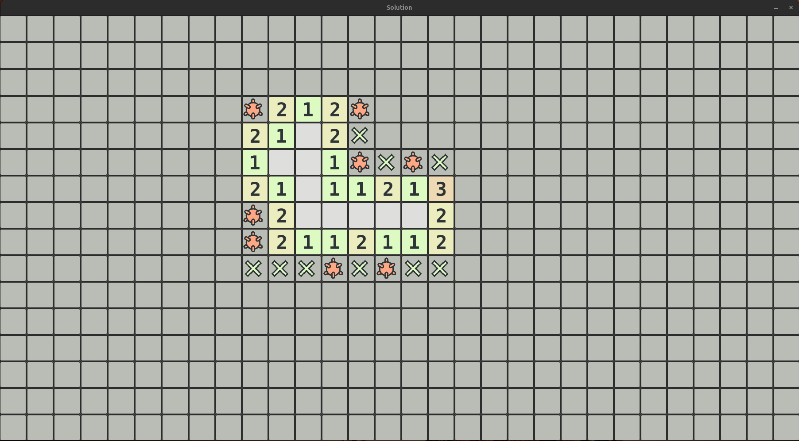

# Minesweeper solver
Solves the current state of a gnome minesweeper game.

  

## Install

Run the following command:

```sh
make compile
```

## Run

Run the solver with:

```sh
make run
```

If you want to see the intermediate steps, run:

```sh
make run-debug
```
After running the program, you have **3 seconds** to put the Minesweeper game in focus.

## Clean

To remove the virtual environment, use:

```sh
make clean
```
